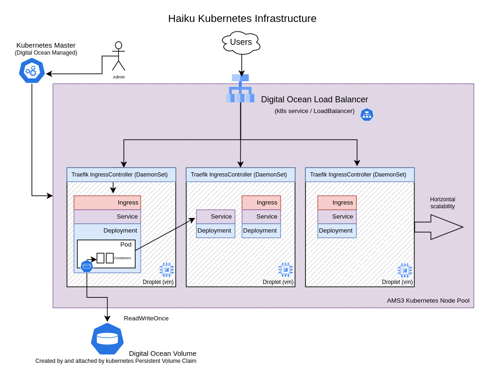

# Infrastructure as code

Treating Haiku's infrastructure as cattle instead of kittens since 2017.

## Directories

  * docs - Full documentation on Haiku's infrastructure
  * containers - Manifests to build and deploy containers
  * deployments - Kubernetes manifests for Haiku infrastructure
  * playground - Things that we're experimenting with. Not used in production.

# Architecture



# Quickstart

These are the path of least resistance for new admins to do "things"

| :boom: DANGER                                                        |
|:---------------------------------------------------------------------|
|*Never* run ```kubectl delete``` on persistent volume claims you need! Running ```kubectl delete``` / ```kubectl delete -f ``` on things describing volume claims will result in Kubernetes dropping (deleting) persistant volumes. (AKA massive + rapid data loss)|

Running through the [Kubernetes Basics](https://kubernetes.io/docs/tutorials/kubernetes-basics/) class is recommended!

## Pre-requirements

* Install kubectl
* Export the Kubernetes configuration from Digital Ocean, import locally
  * If this is your first kubernetes cluster, just put it at ```~/.kube/config```

## Quick Commands

> aka, i'm a sysadmin and a dog in a lab-coat

### Check your configured cluster

*List the known Kubernetes Clusters (contexts) of my client:*
```
kubectl config get-contexts
```

*Change the Kubernetes Cluster my local client focuses on:*
```
kubectl config use-context (NAME)
```

### List Deployments

> Deployments are "how many desired sets of pods" within the cluster.

```
kubectl get deployments
```

### Scaling Deployments

If you want something to "stop running for a while", this is the easiest
and safest way.  NEVER run ```kubectl delete``` if you don't know what
you're doing.

```
kubectl scale --replicas=0 deployments/(NAME)
```

### List Pods

> Pods are one or more tightly related containers running in Kubernetes
> Deleting a Pod will result in the related deployment recreating it.

### Entering a container

aka, equavient to ```docker exec -it (NAME) /bin/bash -l...```

If the pod has one container:

```
kubectl exec -it pod/(NAME) -- /bin/bash -l
```

If the pod has multiple containers:

```
kubectl exec -it pod/(NAME) -c containername -- /bin/bash -l
```

### Examining Stuff

```
kubectl describe pod/(NAME)
kubectl describe deployment/(NAME)
```

## Initial Installation

* Deploy ingress controller via instructions in deployments/ingress-controller/traefik
* Deploy manifests in deployments for various services
* Scale each deployment to 0 replicas
  * ```kubectl scale --replicas=0 deployments/(BLAH)```
* Populate persistent volumes for each application
  * see tools/migration_tools for some scripts to do this en-masse via rsync
* Once ready for switchover, adjust DNS to new load balancer
* Scale up applications
* ```kubectl scale --replicas=1 deployments/(BLAH)```

## Rolling Restarts

*To perform a rolling restart of each deployment replica:*
```
kubectl rollout restart deployment/(NAME)
```

### Example

> -n kube-system is the namespace. We run Traefik in a seperate namespace since it's important.

*Rolling restart of Traefik:*
```
kubectl -n kube-system rollout restart daemonset/traefik-ingress-controller
```

## Rolling Upgrade

Here we upgrade a container image from the command line.  You can also update the matching yml document
and run ```kubectl apply -f (thing).yml```

### Example

> -n kube-system is the namespace. We run Traefik in a seperate namespace since it's important.

*Rolling upgrade of Traefik:*
```
kubectl -n kube-system set image daemonset/traefik-ingress-controller traefik-ingress-lb=docker.io/traefik:v2.6
```

## Accessing Services / Pods

You can port-forward / tunnel from various points within the Kubernetes cluster to your local desktop. This is really
useful for troubleshooting or understanding issues better.

*Listen on localhost port 8888, to port 9999 within the pod*
```
kubectl port-forward pod/(NAME) 8888:9999
```

*Listen on localhost port 8080, to named port web of the service*
```
kubectl port-forward service/(NAME) 8080:web
```

Pressing ctl+c will terminate the port-forwarding proxy

# Secrets

For obvious reasons, :key: secrets are omitted from this repository.
